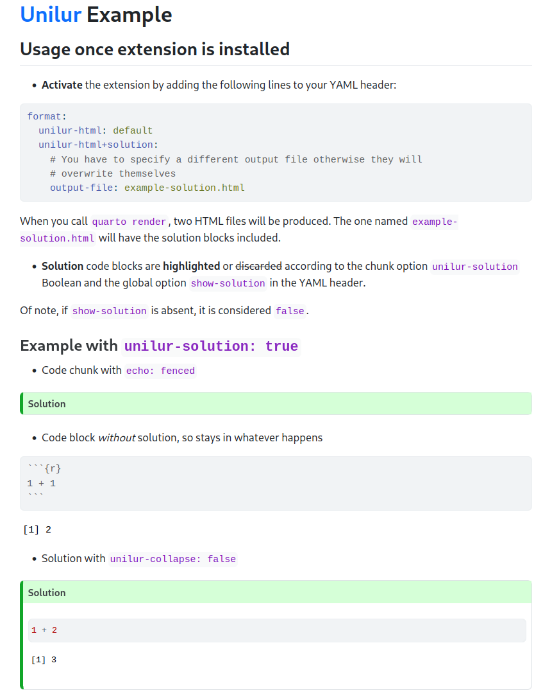
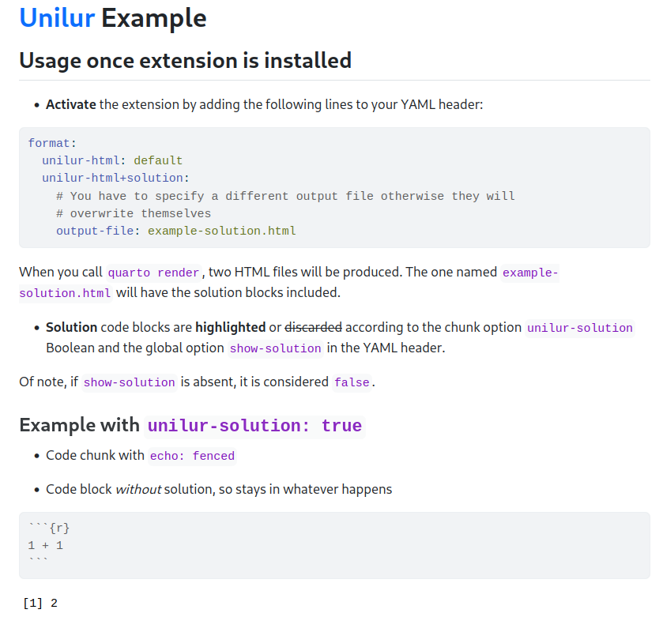

unilur
================

## Aim

Convert [{unilur}](https://github.com/koncina/unilur) developed by
[**Eric Koncina**](https://github.com/koncina) to a
[quarto-ext](https://github.com/quarto-ext). The current package does
more than the hiding/highlighting of **solution** code chunks for
teaching practicals.

## Installation

``` bash
quarto install extension ginolhac/unilur
```

More details are available in Quarto docs for [managing
extensions](https://quarto.org/docs/extensions/#managing-extensions).

## Usage

- **Activate** the extension by adding the following lines to your YAML
  header:

``` yaml
filters:
  - unilur
```

- **Solution** code blocks are either **highlighted** or ~~discarded~~
  according to the `solution` Boolean and the YAML header:

``` yaml
solution: true # or false
```

Of note, if `solution` is absent, it is considered `false`.

- Add the new variable `solution` as [hashpipe,
  `#|`](https://quarto.org/docs/reference/cells/cells-knitr.html) to the
  code chunks that are part of practical answers. Otherwise, chunks are
  left untouched.

<!-- -->

    #| solution: true

See the joined
[`example.qmd`](https://github.com/ginolhac/unilur/blob/main/example.qmd).

## Outputs

| Example `solution: true`                    | Example `solution: false`                       |
|---------------------------------------------|-------------------------------------------------|
|  |  |

## Acknowledgements

People who developed and released extensions I got inspiration from:

- [JJ Allaire](https://github.com/jjallaire) for
  [`filename`](https://github.com/quarto-ext/code-filename) extension
- [Andrie de Vries](https://github.com/andrie) for
  [`reveal-auto-agenda`](https://github.com/andrie/reveal-auto-agenda)
  extension

Moreover:

- [Christophe Dervieux]() for precious advises
- [Mickaël Canouil](https://github.com/mcanouil/) for maintaining the
  [awesome Quarto](https://github.com/mcanouil/awesome-quarto)

### TODO

- Collapse boxes toggle like [original
  {unilur}](http://koncina.github.io/unilur/articles/custom-boxes.html)
- Constant `code-collapse: true` so green frame encompasses code output?
- Better CSS rules:
  - `Solution` code header in main font)
  - Dark mode not really working

### Debugging

This helped me developing this extension.

To get the intermediate markdown document:

    quarto render example.qmd -M keep-md:true

    /usr/lib/rstudio/resources/app/bin/quarto/bin/tools/pandoc -f markdown -t json -o ast.json example.md

Then visualize the Abstract Syntax Tree (AST) using [this
code](https://bookdown.org/yihui/rmarkdown-cookbook/lua-filters.html)

<details>
<summary>
pandoc AST
</summary>

``` r
xfun:::tree(
  jsonlite::fromJSON('ast.json', simplifyVector = FALSE)
)
```

``` markdown
List of 3
 |-pandoc-api-version:List of 3
 |  |-: int 1
 |  |-: int 22
 |  |-: int 2
 |-meta              :List of 5
 |  |-execute:List of 2
 |  |  |-t: chr "MetaMap"
 |  |  |-c:List of 1
 |  |     |-keep-md:List of 2
 |  |        |-t: chr "MetaBool"
 |  |        |-c: logi TRUE
 |  |-filters:List of 2
 |  |  |-t: chr "MetaList"
 |  |  |-c:List of 1
 |  |     |-:List of 2
 |  |        |-t: chr "MetaInlines"
 |  |        |-c:List of 1
 |  |           |-:List of 2
 |  |              |-t: chr "Str"
 |  |              |-c: chr "unilur"
 |  |-format :List of 2
 |  |  |-t: chr "MetaMap"
 |  |  |-c:List of 1
 |  |     |-html:List of 2
 |  |        |-t: chr "MetaMap"
 |  |        |-c:List of 1
 |  |           |-theme:List of 2
 |  |              |-t: chr "MetaInlines"
 |  |              |-c:List of 1
 |  |                 |-:List of 2
 |  |                    |-t: chr "Str"
 |  |                    |-c: chr "cosmo"
 |  |-title  :List of 2
 |  |  |-t: chr "MetaInlines"
 |  |  |-c:List of 3
 |  |     |-:List of 2
 |  |     |  |-t: chr "Str"
 |  |     |  |-c: chr "Unilur"
 |  |     |-:List of 1
 |  |     |  |-t: chr "Space"
 |  |     |-:List of 2
 |  |        |-t: chr "Str"
 |  |        |-c: chr "Example"
 |  |-unilur :List of 2
 |     |-t: chr "MetaMap"
 |     |-c:List of 1
 |        |-solution:List of 2
 |           |-t: chr "MetaInlines"
 |           |-c:List of 1
 |              |-:List of 2
 |                 |-t: chr "Str"
 |                 |-c: chr "true"
 |-blocks            :List of 5
    |-:List of 2
    |  |-t: chr "Div"
    |  |-c:List of 2
    |     |-:List of 3
    |     |  |-: chr ""
    |     |  |-:List of 1
    |     |  |  |-: chr "cell"
    |     |  |-:List of 1
    |     |     |-:List of 2
    |     |        |-: chr "solution"
    |     |        |-: chr "true"
    |     |-:List of 2
    |        |-:List of 2
    |        |  |-t: chr "CodeBlock"
    |        |  |-c:List of 2
    |        |     |-:List of 3
    |        |     |  |-: chr ""
    |        |     |  |-:List of 1
    |        |     |  |  |-: chr "cell-code"
    |        |     |  |-: list()
    |        |     |-: chr "```{r}\n#| solution: true\n\n1 + 1\n```"
    |        |-:List of 2
    |           |-t: chr "Div"
    |           |-c:List of 2
    |              |-:List of 3
    |              |  |-: chr ""
    |              |  |-:List of 2
    |              |  |  |-: chr "cell-output"
    |              |  |  |-: chr "cell-output-stdout"
    |              |  |-: list()
    |              |-:List of 1
    |                 |-:List of 2
    |                    |-t: chr "CodeBlock"
    |                    |-c:List of 2
    |                       |-:List of 3
    |                       |  |-: chr ""
    |                       |  |-: list()
    |                       |  |-: list()
    |                       |-: chr "[1] 2"
    |-:List of 2
    |  |-t: chr "Para"
    |  |-c:List of 1
    |     |-:List of 2
    |        |-t: chr "Str"
    |        |-c: chr "Classic"
    |-:List of 2
    |  |-t: chr "Div"
    |  |-c:List of 2
    |     |-:List of 3
    |     |  |-: chr ""
    |     |  |-:List of 1
    |     |  |  |-: chr "cell"
    |     |  |-: list()
    |     |-:List of 2
    |        |-:List of 2
    |        |  |-t: chr "CodeBlock"
    |        |  |-c:List of 2
    |        |     |-:List of 3
    |        |     |  |-: chr ""
    |        |     |  |-:List of 1
    |        |     |  |  |-: chr "cell-code"
    |        |     |  |-: list()
    |        |     |-: chr "```{r}\n1 + 1\n```"
    |        |-:List of 2
    |           |-t: chr "Div"
    |           |-c:List of 2
    |              |-:List of 3
    |              |  |-: chr ""
    |              |  |-:List of 2
    |              |  |  |-: chr "cell-output"
    |              |  |  |-: chr "cell-output-stdout"
    |              |  |-: list()
    |              |-:List of 1
    |                 |-:List of 2
    |                    |-t: chr "CodeBlock"
    |                    |-c:List of 2
    |                       |-:List of 3
    |                       |  |-: chr ""
    |                       |  |-: list()
    |                       |  |-: list()
    |                       |-: chr "[1] 2"
    |-:List of 2
    |  |-t: chr "Para"
    |  |-c:List of 1
    |     |-:List of 2
    |        |-t: chr "Str"
    |        |-c: chr "Solution"
    |-:List of 2
       |-t: chr "Div"
       |-c:List of 2
          |-:List of 3
          |  |-: chr ""
          |  |-:List of 1
          |  |  |-: chr "cell"
          |  |-:List of 1
          |     |-:List of 2
          |        |-: chr "solution"
          |        |-: chr "true"
          |-:List of 2
             |-:List of 2
             |  |-t: chr "CodeBlock"
             |  |-c:List of 2
             |     |-:List of 3
             |     |  |-: chr ""
             |     |  |-:List of 2
             |     |  |  |-: chr "r"
             |     |  |  |-: chr "cell-code"
             |     |  |-: list()
             |     |-: chr "1 + 2"
             |-:List of 2
                |-t: chr "Div"
                |-c:List of 2
                   |-:List of 3
                   |  |-: chr ""
                   |  |-:List of 2
                   |  |  |-: chr "cell-output"
                   |  |  |-: chr "cell-output-stdout"
                   |  |-: list()
                   |-:List of 1
                      |-:List of 2
                         |-t: chr "CodeBlock"
                         |-c:List of 2
                            |-:List of 3
                            |  |-: chr ""
                            |  |-: list()
                            |  |-: list()
                            |-: chr "[1] 3"
```

</details>
